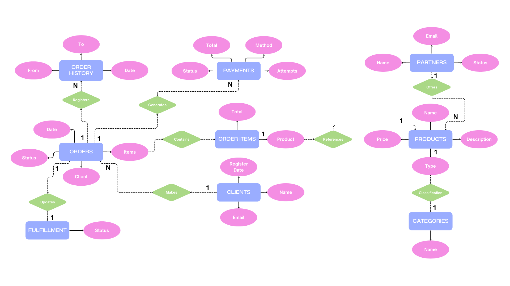
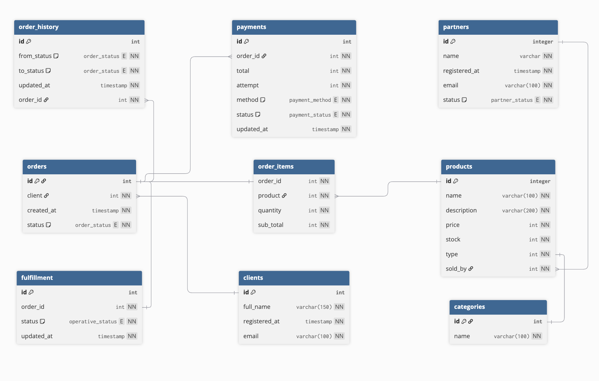

# CrudActivity-Delivery-Ops

# Design
## DER

### Análisis del diagrama

#### Cardinalidades de cada relación del diagrama

- CLIENTE — realiza → PEDIDO 1:N — Un cliente puede realizar muchos pedidos, pero cada pedido pertenece a un solo cliente.
- PEDIDO — contiene → PRODUCTO N:M — Un pedido puede tener múltiples productos, y un producto puede aparecer en múltiples pedidos. (Esta relación genera la entidad intermedia ITEM_PEDIDO al pasar al modelo relacional)
- VENDEDOR — publica → PRODUCTO 1:N — Un vendedor puede publicar muchos productos, pero cada producto pertenece a un solo vendedor.
- CATEGORÍA — clasifica → PRODUCTO 1:N — Una categoría agrupa muchos productos, pero cada producto pertenece a una sola categoría. (Si se permite multicategoría, sería N:M)
- PEDIDO — genera → PAGO 1:N — Un pedido puede tener múltiples intentos de pago, pero cada pago está asociado a un solo pedido.
- PEDIDO — opera → FULFILLMENT 1:1 — Cada pedido tiene exactamente un registro de fulfillment operativo y viceversa.
- PEDIDO — registra → HISTORIAL PEDIDO 1:N — Un pedido tiene muchos registros de historial (uno por cada cambio de estado), pero cada entrada del historial pertenece a un solo pedido.

La relación más importante a destacar es la N:M de PEDIDO-PRODUCTO, ya que es la única que requiere una entidad asociativa para poder implementarse en base de datos.

## Relational Model

### Análisis del modelo

#### El modelo cumple 3FN

- 1FN — Atomicidad
Todas las columnas tienen valores atómicos (un solo valor por celda). No hay campos multivaluados ni grupos repetidos. Por ejemplo, en lugar de guardar los productos de un pedido como una lista dentro de orders, se creó order_items como tabla separada. 

- 2FN — Dependencia total de la clave
Aplica a tablas con claves compuestas. order_items tiene clave compuesta (order_id, product) y todos sus atributos (quantity, sub_total) dependen de ambas columnas juntas, no solo de una. Si sub_total dependiera solo de product, sería una violación — pero aquí depende de la combinación orden + producto. 

- 3FN — Sin dependencias transitivas
Ninguna columna no-clave depende de otra columna no-clave. 

#### Ejemplos de normalización

- status en varias tablas es un enum, no un string libre — evita redundancia y garantiza consistencia sin necesitar una tabla lookup.
- Los datos del cliente no están dentro de orders (nombre, email, etc.). orders solo guarda client como FK — si el cliente cambia su email, se actualiza en un solo lugar.
- Los datos del producto no están dentro de order_items. Solo se guarda la FK product.
- fulfillment está separado de orders — sus atributos operativos (status, updated_at) dependen del fulfillment en sí, no del pedido directamente.
- partners está separado de products — la info del vendedor no depende del producto.

# Investigation

## ¿Qué es una migración?

1. La migración en bases de datos es el proceso de modificar la estructura de una base de datos de forma controlada y versionada.

2. La migración de bases de datos se refiere a la migración de datos de una base de datos de origen a una base de datos de destino a través de herramientas de migración de bases de datos. Una vez finalizado el proceso de migración, el conjunto de datos de la base de datos de origen reside completamente en la base de datos de destino, a menudo de forma reestructurada.

### Para qué se usa en proyectos reales.

Porque en proyectos reales:

- Hay varios desarrolladores.
- La base de datos evoluciona constantemente.
- Hay diferentes entornos (desarrollo, pruebas, producción).
- Se necesita control y trazabilidad.

Las migraciones permiten que todos tengan la misma estructura de base de datos, sin inconsistencias.

### Ventajas frente a ejecutar scripts manualmente.

Las migraciones de estructura permiten llevar control de versiones, ejecutar cambios de forma automática, reproducible y reversible, reduciendo errores humanos y asegurando consistencia entre entornos, a diferencia de los scripts manuales que dependen de ejecución y control manual.

| Migraciones                    | Scripts manuales          |
| ------------------------------ | ------------------------- |
| Versionadas                    | No necesariamente         |
| Automáticas                    | Manuales                  |
| Permiten rollback              | No                        |
| Reducen errores                | Más propensos a errores   |
| Ideales para trabajo en equipo | Riesgo de inconsistencias |

Ejemplo: cómo ayuda a versionar la base de datos en equipo.

Las migraciones permiten versionar la base de datos porque guardan cada cambio estructural como un archivo que se integra al control de versiones del proyecto, permitiendo que todos los miembros del equipo apliquen los mismos cambios en orden y mantengan consistencia entre entornos.

Las migraciones permiten:
- Llevar historial cronológico de cambios
- Saber quién hizo qué cambio
- Aplicar cambios en orden
- Reproducir la base desde cero
- Revertir si algo sale mal

Es como Git, pero para la base de datos.

## ¿Qué es un seed (seeding)?
Un seed es un proceso que permite insertar datos iniciales o de prueba en la base de datos de forma automática.

### Para qué se usa.

- Insertar datos iniciales obligatorios
- Crear usuarios por defecto (ej: admin)
- Insertar roles del sistema
- Agregar datos de prueba para desarrollo
- Poblar catálogos

### Diferencias entre datos de prueba, datos iniciales y datos de negocio.

1. Datos de prueba (Test Data)

Son datos creados solo para probar el sistema.

Se usan en:

- Desarrollo
- Testing
- QA
- Pruebas automatizadas

Ejemplos:

- Usuarios falsos
- Correos inventados
- Registros simulados
- Pedidos ficticios

No son datos reales.
Se pueden borrar sin problema.
No afectan el negocio real.

2. Datos iniciales (Seed Data)

Son datos que el sistema necesita para funcionar desde el inicio.

Se insertan normalmente con seeding.

Ejemplos:

- Roles (Admin, User, Recruiter)
- Estados (Activo, Inactivo, Pendiente)
- Tipos de documento
- Países
- Categorías base

Son obligatorios para que la aplicación funcione correctamente.
No son datos del cliente, sino configuraciones base.

3. Datos de negocio (Business Data)

Son los datos reales generados por el uso del sistema.

Provienen de:

- Usuarios reales
- Transacciones reales
- Operaciones diarias

Ejemplos:

- Candidatos registrados
- Aplicaciones a vacantes
- Ventas realizadas
- Pagos procesados

Son el activo principal del sistema.
No deben borrarse en producción.
Tienen impacto legal y financiero.

### Cuándo conviene y cuándo no.

El seeding conviene cuando se requiere insertar datos estructurales y necesarios para el funcionamiento inicial del sistema, especialmente en entornos colaborativos; no conviene para datos dinámicos, sensibles o generados por la operación real del negocio.

#### ¿Cuándo CONVIENE usar seeding?
1.  Cuando el sistema necesita datos mínimos para funcionar

    Ejemplos: 
    - Roles (Admin, User)
    - Estados (Activo, Pendiente)
    - Tipos (categorías, niveles, prioridades)

2. Cuando trabajas en equipo

    El seeding garantiza que:
    - Todos tengan los mismos datos base
    - No haya inconsistencias
    - Nadie tenga que insertar datos manualmente

3. Cuando necesitas entornos reproducibles

    En:
    - Desarrollo
    - Testing
    - Staging
    -> Puedes levantar la base desde cero y tenerla lista en segundos.

4. Para catálogos estables

    Datos que:
    - No cambian frecuentemente
    - Son estructurales del sistema

#### ¿Cuándo NO conviene usar seeding?
1. Para datos de negocio reales -> Eso no es configuración, es operación.

2. Cuando los datos cambian constantemente

    Si algo:
    - Se edita a diario
    - Es dinámico
    - Depende del usuario
    -> No debería estar en un seed.

3. En producción para datos masivos

    No es buena práctica usar seed para:
    - Migraciones de millones de registros
    - Transferencias de bases completas
    -> Ahí se usan procesos de migración de datos más especializados.

4. Cuando puede generar duplicados

    Si el seed no está bien diseñado (sin validaciones), puede:
    - Duplicar información
    - Romper relaciones
    - Generar inconsistencias

## Usos y buenas prácticas (optional)

### Cómo migraciones y seeds apoyan el CI/CD.

CI/CD es una práctica que automatiza la integración, prueba y despliegue del software. Las migraciones apoyan el CI/CD permitiendo actualizar automáticamente la estructura de la base de datos durante el despliegue, mientras que el seeding asegura la existencia de datos iniciales necesarios para el correcto funcionamiento y pruebas del sistema.

CI → Continuous Integration (Integración Continua)
    Significa que cada vez que alguien del equipo:
    - Hace un git push
    - O abre un Pull Request
    El sistema automáticamente:
    - Compila el proyecto
    - Ejecuta pruebas
    - Verifica que nada esté roto
    Si algo falla
    - No se aprueba el cambio.

Objetivo: detectar errores rápido.

CD → Continuous Delivery o Continuous Deployment
    Después de que el código pasa las pruebas:
    Puede:
    - Subirse automáticamente a un servidor
    - Publicarse en producción
    - Actualizar la aplicación

Sin que alguien tenga que hacerlo manualmente.

CI/CD es un pipeline automatizado que:

- Recibe código nuevo
- Lo prueba
- Lo valida
- Lo despliega

Es una práctica de desarrollo donde el código se integra, prueba y despliega automáticamente.

- Con migraciones en CI/CD 

    En el pipeline se agrega un paso:
    1. Deploy del código
    2. Ejecutar migraciones automáticamente
    3. Ejecutar seed si es necesario
    Así:
    - La base se actualiza sola.
    - Todos los entornos quedan sincronizados.
    - No dependes de que alguien entre manualmente al servidor.

- Seeding

    El seed ayuda a:
    - Insertar datos iniciales en nuevos entornos
    - Preparar bases temporales para pruebas automáticas
    - Crear datos controlados para testing

    Ejemplo:
    - Cada vez que el pipeline crea una base temporal para correr pruebas, ejecuta:
        - Migraciones
        - Seed de datos de prueba
        
        Y todo queda listo sin intervención humana.

| Elemento    | Cómo ayuda                                                       |
| ----------- | ---------------------------------------------------------------- |
| Migraciones | Actualizan automáticamente la estructura en cada despliegue      |
| Seeds       | Garantizan datos mínimos para que la app funcione o para pruebas |

### Cómo evitar “datos rotos” o inconsistencias al poblar el entorno.

# Índices implementados

1. idx_payments_order_status (order_id, status)
Optimiza consultas que verifican pagos aprobados por orden, incluyendo validaciones dentro del procedimiento almacenado y análisis de inconsistencias.
Se eligieron estos campos porque las consultas filtran frecuentemente por ambos atributos simultáneamente.

2. idx_orders_client (client_id)
Optimiza consultas analíticas relacionadas con clientes frecuentes, ranking mensual y reportes financieros por cliente.
Se eligió client_id debido a su uso recurrente en JOINs y agrupaciones.